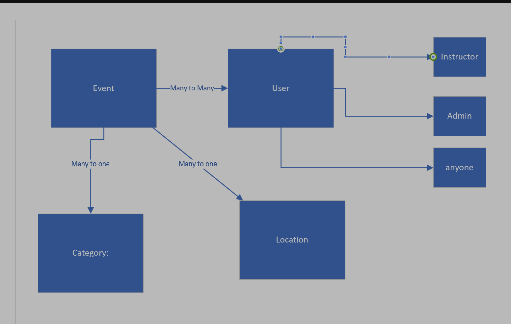
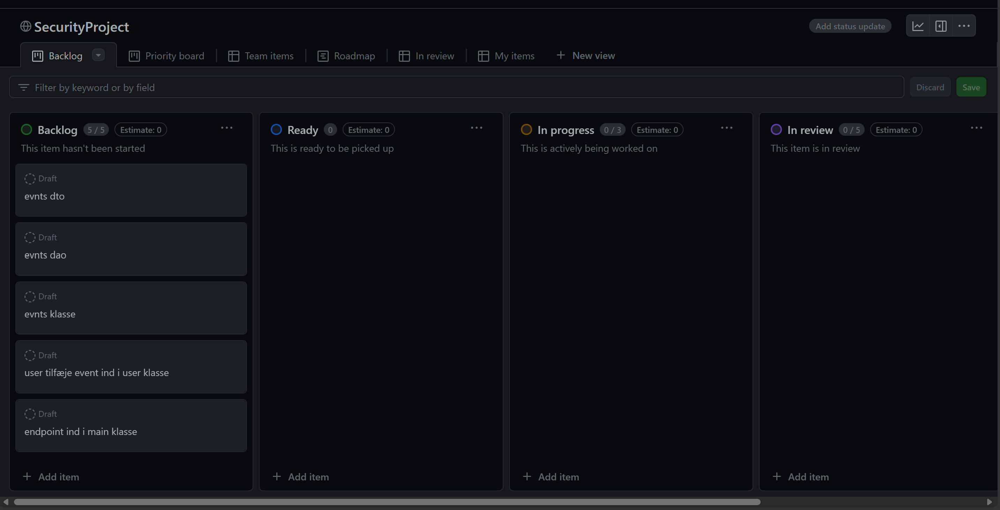
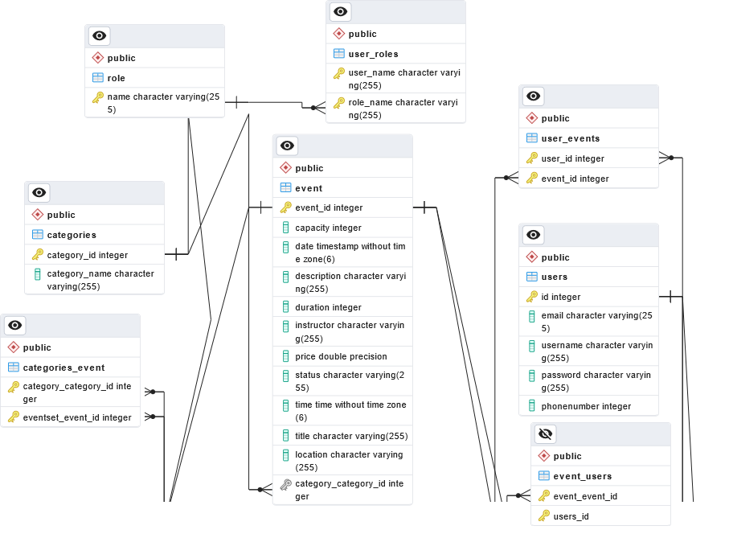

# SecurityProjectGroup6

## Domain digram

## ERD Diagram

# End Points

## Events Routes 
#### HTTP 	REST Resource 		                        Response                                   Comment
#### GET     /api/events/                                response: {List of all events}             Retrieve all events
#### GET     /api/events/{id}                            response: {Event by ID}                    Retrieve an event by its ID
#### POST    /api/events/create                          request payload: {Event details}           Add a new event
#### PUT     /api/events/update/{id}                     request payload: {Updated event details}   Update an event by ID
#### DELETE  /api/events/delete/{id}                     response: {Confirmation message}           Delete an event by ID
#### GET     /api/events/allregistrations/{event_id}     response: {List of registrations}          Retrieve all registrations for an event
#### GET     /api/events/registration/{event_id}         response: {Registration count}             Retrieve registration count by event ID
#### PUT     /api/events/registrations/{event_id}        request payload: {User registration}       Register a user for an event
#### POST    /api/events/eventregistration/{event_id}    request payload: {User registration}       Register a user for an event
#### POST    /api/events/removeuserevent/{event_id}      request payload: {User ID}                 Remove a user from an event
#### GET     /api/events/eventsbycategory/{category_id}  response: {Events by Category}             Retrieve all events by category
#### GET     /api/events/eventsbystatus/{status}         response: {Events by Status}               Retrieve all events by status

## User Routes
#### GET     /api/user/all                               response: {List of all users}              Retrieve all users
#### GET     /api/user/{id}                              response: {User by ID}                     Retrieve a user by its ID
#### POST    /api/user/create                            request payload: {User details}            Add a new user
#### PUT     /api/user/update/{id}                       request payload: {Updated user details}    Update a user by ID
#### DELETE  /api/user/delete/{id}                       response: {Confirmation message}           Delete a user by ID
#### POST    /api/user/logout                            response: {Logout confirmation}            Log out a user

## Security and Authentication
#### POST    /api/auth/login                             request payload: {Login credentials}       Authenticate a user
#### POST    /api/auth/register                          request payload: {Registration details}    Register a new user
#### POST    /api/auth/resetpassword                     request payload: {Reset details}           Reset user password

## Protected Routes
#### GET     /api/protected/user                         response: {Protected message}              Access protected content for USER
#### GET     /api/protected/instructor                   response: {Protected message}              Access protected content for INSTRUCTOR
#### GET     /api/protected/admin                        response: {Protected message}              Access protected content for ADMIN

